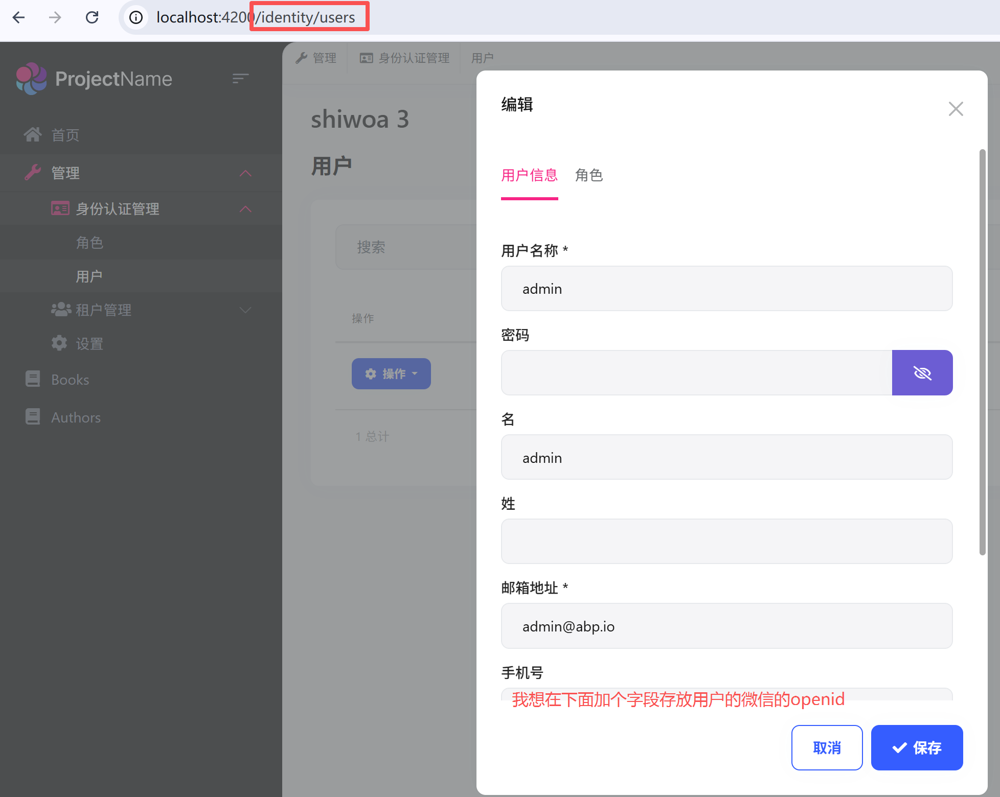
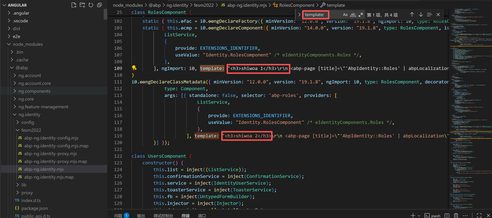
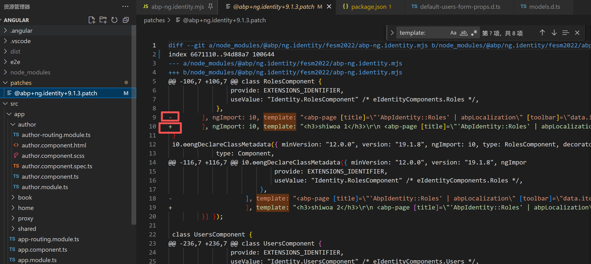
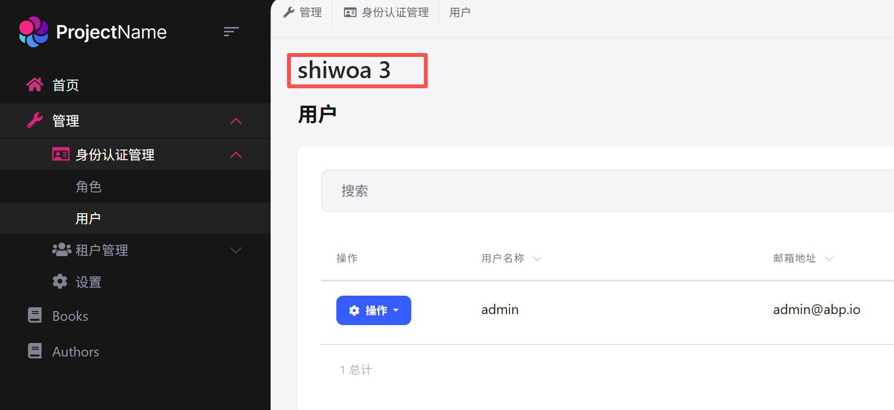

#### 前言

1.因为abp studio创建的一套代码，我新建的项目，前端框架选的是Angular,他的界面是封装在npm包里面的，所以改动难度还是有点大，但是如果不得不改的情况下，则我们就需要学会更改npm包的代码并且重新构建

其他极端情况，比如npm包本身就有bug，所以我们学会这项技能也是有益无害

#### 1.patch-package使用

##### 1.先看要修改的标准界面的url

用户界面位于indentity.users



##### 2.定位Angular前端代码npm包位置

一般是以.mjs结尾，这次是node_modules\@abp\ng.identity\fesm2022\abp-ng.identity.mjs ，根据Angular Component语法template:存放的是html的代码，我根据"template:"关键字搜索，发现有4处，我不确定是哪一处代码，所以我加个标题1234，看到时候界面显示那个，我就能定位要改的html位置



##### 3.使用 patch-package增量覆盖npm包代码

```
# 安装 patch-package
npm install --save-dev patch-package

# 在 package.json 的 scripts 中添加
"scripts": {
  "postinstall": "patch-package"
}

# 运行生成补丁
npx patch-package @abp/ng.identity

# 清除 Angular 缓存(这个非常重要)
npm run ng cache clean

#npm 构建一下
npm install

# 重新启动开发服务器
npm start
```

patch-package他会非常智能，修改前后都记录下来了，他相当于后手覆盖补丁



##### 4.看一下效果

可以看到第三处的template是我要改的代码位置




